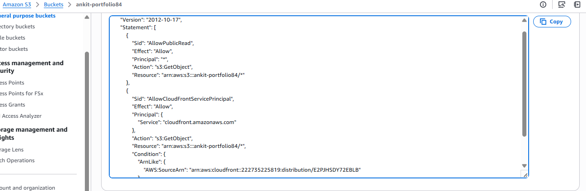
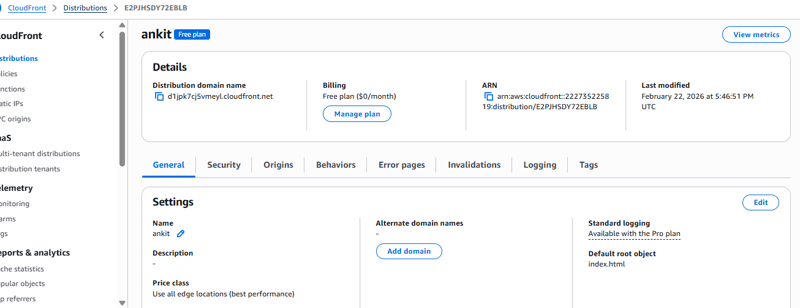

# AWS S3 Static Portfolio Hosting

## Steps Performed

1. Created HTML/CSS portfolio locally
2. Initialized Git & pushed to GitHub
3. Created S3 bucket
4. Enabled static website hosting
5. Added bucket policy for public access
6. Uploaded files using AWS CLI
7. Created CloudFront distribution
8. Enabled HTTPS redirection

## Hosted URL
https://d1jpk7cj5vmeyl.cloudfront.net

